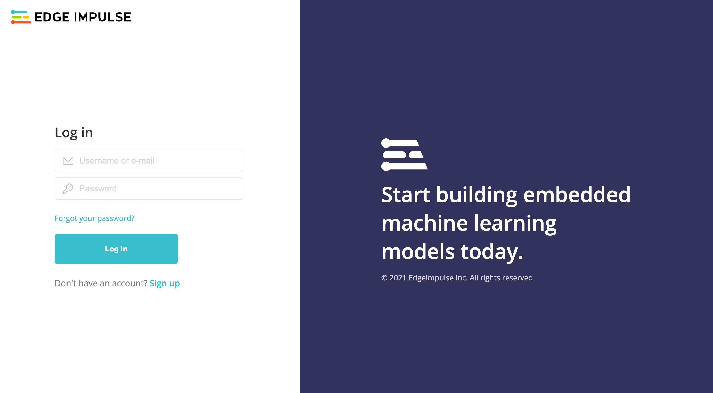

# Exploring Machine Learning with Edge Impulse
{:.no_toc}

* TOC
{:toc}

## What is Edge Impulse?

## Challenges of Deploying ML into the Real World

## Getting Started with Edge Impulse

1. First, create an account on Edge Impulse: [https://studio.edgeimpulse.com/signup](https://studio.edgeimpulse.com/signup)  
    
1. Validate your email by clicking the link in the email sent to your account’s email address

### Troubleshooting

#### Phone: Not connected

This error sometimes occurs when you leave your web browser app for a different app on your phone. Try refreshing your browser page, if that doesn't reconnect you, follow steps X through X from the [Getting Started with Edge Impulse](#getting-started-with-edge-impulse) steps above to reconnect your phone to your Edge Impulse project.

#### Phone: Failed to load

This error occurs when you don't give the web browser access to your microphone. Refresh your browser page and allow microphone access as seen in step X from the [Getting Started with Edge Impulse](#getting-started-with-edge-impulse) steps above.

## Discussion Questions
