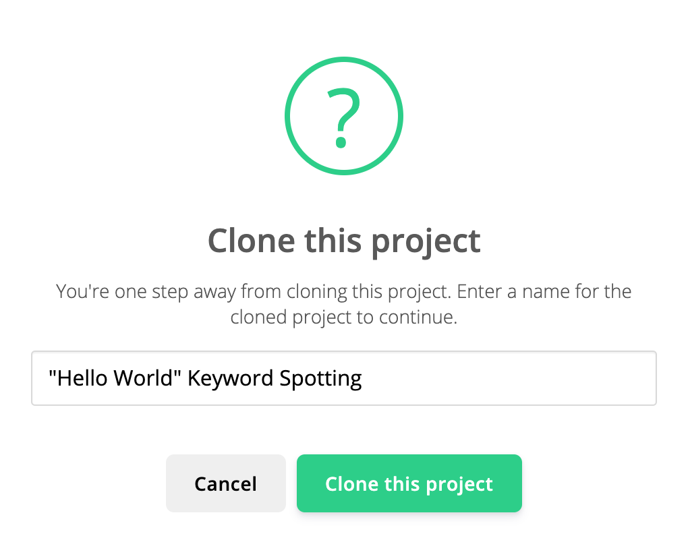
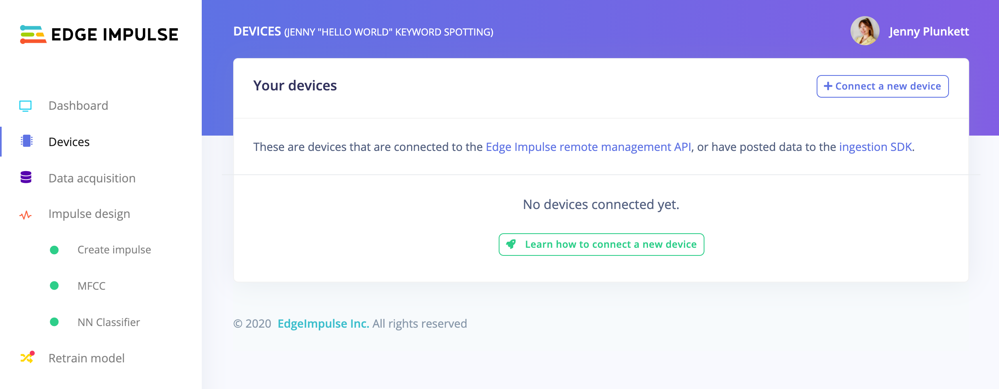
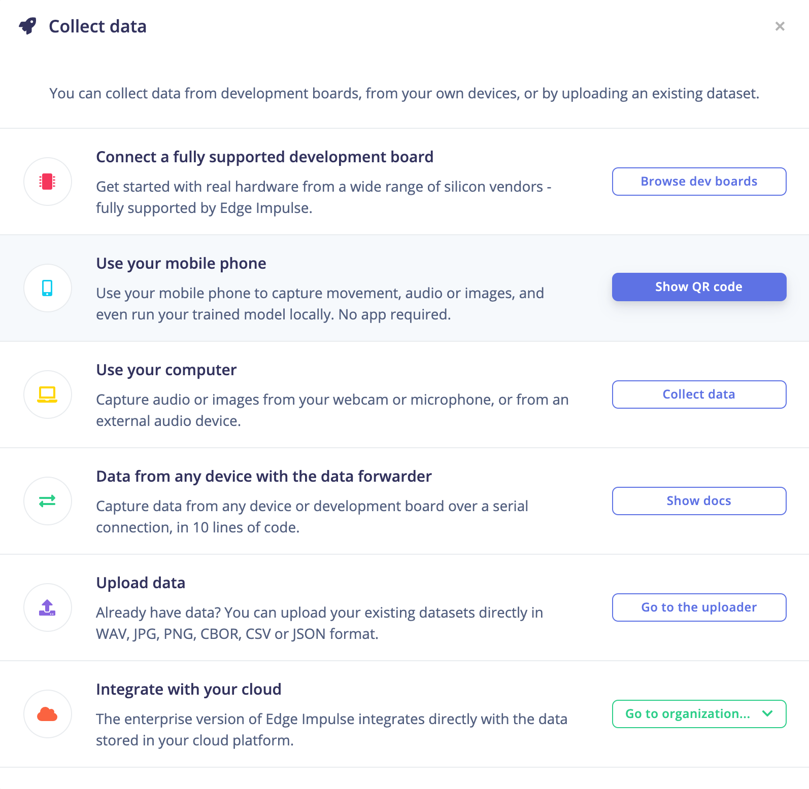
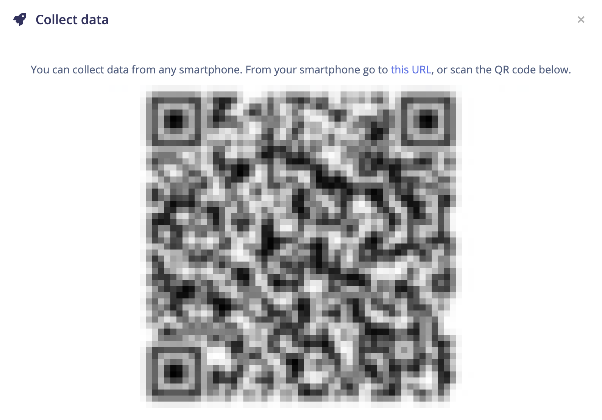

# *Build it!* Creating your own application with Edge Impulse
{:.no_toc}

* TOC
{:toc}

## Building a Custom Keyword Spotting Model

Yesterday we analyzed a pre-trained keyword spotting model using the keyword "hello world" with audio samples from a small set of participants. Today we will see how machine learning becomes even more powerful when we train a model with it's potential biases in mind, such as the tone, pitch, or accent of the keyword audio samples, or even the language of the keyword itself.

### Creating a Crowdsourced Dataset

1. Grab your phone, open up the Camera app and scan the QR code below by pointing your camera at your computer screen:

### Deploy your Custom Model

Now that we have collected our crowdsourced dataset and designed/trained our custom keyword spotting model, we can deploy this model to our phones for keyword spotting on the edge in real time.

1. Login to your Edge Impulse account: [https://studio.edgeimpulse.com/](https://studio.edgeimpulse.com/)  
1. Clone the Navajo custom keyword spotting project to your own Edge Impulse account. Click the following link and then click the **Clone this project** button on the top right corner of the page: [https://studio.edgeimpulse.com/public/35699/latest](https://studio.edgeimpulse.com/public/35699/latest)  
    
1. Change the name of your cloned project if you would like, then click the green **Clone this project** button:  
    
1. When the studio has finished cloning the project, select the "Devices" tab and click the **Connect a new device** button:  
      
    
1. From the "Collect data" pop-up box, click on the **Show QR code** button next to "Use your mobile phone":  
    
1. Grab your phone, open up the Camera app and scan the QR code that was generated for you by pointing your camera at your computer screen. An example of the QR code is shown below (this QR code is blurred out and unusable):  
    
1. Once you have scanned the QR code, your phone's web browser will appear loading the the "Data collection" web application. At the bottom of the page, click on the **Switch to classification mode** button:  
    
1. Click the **Give access to the microphone** button, and then click **Allow**:  
    

### Troubleshooting

### Troubleshooting

#### Phone: Not connected

This error sometimes occurs when you leave your web browser app for a different app on your phone. Try refreshing your browser page, if that doesn't reconnect you, follow steps 5 through 8 from the [Deploy your custom model](#deploy-your-custom-model) steps above to reconnect your phone to your Edge Impulse project.

#### Phone: Failed to load

This error occurs when you don't give the web browser access to your microphone. Refresh your browser page and allow microphone access as seen in step 9 from the [Deploy your custom model](#deploy-your-custom-model) steps above.

## Bonus: Tiny Image Classification

